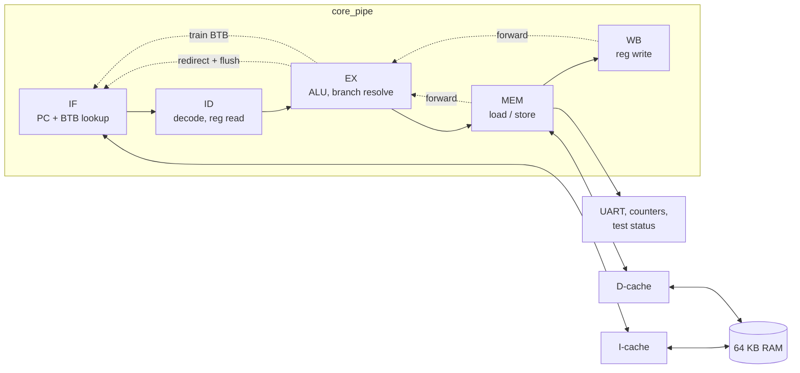
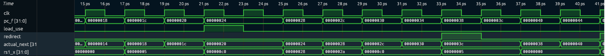

# RV32I RISC-V CPU in SystemVerilog


A 5-stage pipelined RISC-V processor (RV32I) with forwarding, hazard detection, a branch predictor and instruction/data caches. It's verified in Verilator against the official riscv-tests suite and against my own single-cycle reference core, and it runs C programs compiled with GCC.

```
$ make run PROG=hello
Hello from my CPU
10! = 3628800
1000000 / 7 = 142857 rem 1
...
PASS (15405 cycles)
```

## Highlights

- **Passes the official RISC-V compliance tests**: 41/42 rv32ui tests on every configuration. The last one, `ma_data`, tests misaligned loads/stores; the spec allows a core to handle them in hardware *or* trap, and this core traps (stops with a `misaligned access` fault), which the test runner checks for.
- **Differential testing**: every pipelined configuration retires exactly the same instructions (over 1 million per configuration), with identical PCs, register writes and stores, as the single-cycle reference core.
- **Branch predictor**: a 64-entry BTB with 2-bit counters. Accuracy is 89–99.9%, and it cuts pipeline CPI from 1.30–1.39 to 1.01–1.10.
- **Caches**: direct-mapped I$/D$ with configurable size and miss penalty. Hit rates were measured at 256 B / 1 KB / 4 KB.
- **Runs C**: my own startup code, linker script, UART printing and software multiply/divide (RV32I has no `mul`).
- **One command** runs everything: `make test`.

## Architecture



| Hazard | Handling | Penalty |
|---|---|---|
| Data (ALU → ALU) | forward from EX/MEM and MEM/WB; regfile write-through for WB → ID | 0 |
| Load-use | stall IF/ID, bubble into EX | 1 cycle |
| Branch / jump | resolve in EX, flush IF/ID + ID/EX (predicted with the BTB when BP is on) | 2 cycles on mispredict |
| Cache miss | freeze pipeline | miss penalty |



*`hazards.S` on the pipeline. 21–23 ps: `load_use` stalls fetch for one cycle (`pc_f` holds `0x24`). 33–35 ps: the taken `beq` sets `redirect`, and fetch jumps from `0x38` to `0x3c`, throwing away the two wrong-path instructions.*

## Results

CPI per benchmark kernel, measured with the CPU's own performance counters (`make bench` → [docs/results.md](docs/results.md)):

| Config | sort | matmul | crc32 |
|---|---|---|---|
| single-cycle | 1.000 | 1.000 | 1.000 |
| pipeline, predict not-taken | 1.335 | 1.390 | 1.300 |
| + branch predictor | 1.006 | 1.074 | 1.100 |
| + 256 B caches (10-cycle miss) | 1.275 | 1.166 | 2.003 |
| + 1 KB caches | 1.014 | 1.088 | 1.268 |
| + 4 KB caches | 1.014 | 1.077 | 1.200 |

| Benchmark | Branch predictor accuracy | D$ hit rate 256 B / 1 KB / 4 KB |
|---|---|---|
| sort (256 ints) | 99.1% | 84.0 / 99.6 / 99.6% |
| matmul (16×16) | 89.2% | 43.4 / 91.5 / 98.4% |
| crc32 (4 KB) | 99.9% | 54.9 / 91.7 / 95.1% |

Single-cycle CPI is 1 by definition, but its clock period covers the whole datapath, so the pipeline is faster in wall-clock time even at CPI 1.3. The cached rows model a slow memory behind the cache; the "no cache" rows assume ideal single-cycle RAM.

## Running it

macOS (Homebrew):
```
brew install verilator surfer lz4 riscv64-elf-gcc
```
Ubuntu:
```
sudo apt install verilator gcc-riscv64-unknown-elf python3
```

```
make test                          # unit tests, programs, rv32ui and trace comparison on 4 configs
make bench                         # benchmarks on all 6 configs -> docs/results.md
make run PROG=hello                # run one program (asm, C, or benchmark name)
make run PROG=sort CFG=c1k         # CFG: single pipe bp c256 c1k c4k
make run PROG=hazards PIPEVIEW=1   # cycle-by-cycle pipeline chart -> build/sw/hazards.pipeview
make run PROG=fib WAVE=1           # waveform, then: make wave T=sw/fib
```

## Verification

| Level | What | Where |
|---|---|---|
| Unit | ALU (111k vectors incl. edge cases), register file (40k random cycles), immediate generator (100k) against C++ models | `tb/` |
| Programs | 5 self-checking assembly programs, hello + 3 self-checking C benchmarks | `sw/programs`, `sw/c` |
| Compliance | riscv-tests rv32ui: 41 pass, `ma_data` must end in the misaligned-access fault | `tests/` |
| Differential | instruction traces of every program and test, pipeline vs single-cycle, line by line | `scripts/compare_traces.py` |
| Mutation | 18 bugs planted by hand (hazards, predictor, caches, decode) to confirm the tests catch each one | `docs/notes-*.md` |

## Repository layout

```
rtl/      riscv_pkg, alu, regfile, immgen, decoder, core_single, core_pipe, cache, ram, soc
tb/       Verilator C++ testbenches
sw/       linker script, crt0 + tiny libc (sw/lib), asm tests, C programs and benchmarks
tests/    riscv-tests rv32ui (copied from upstream) + my test environment header
scripts/  test runners, trace comparison, benchmark report
docs/     design notes per milestone, bug log, results
```

## Memory map

| Address | |
|---|---|
| `0x0000_0000 – 0x0000_FFFF` | 64 KB RAM, code at 0, stack from the top |
| `0x1000_0000` | UART TX (store a byte to print it) |
| `0x1000_0004` | cycle counter |
| `0x1000_0008` | test status: 1 = pass, `(n<<1)\|1` = test n failed; ends the simulation |
| `0x1000_000C – 0x1000_0024` | instret, branches, redirects, I$/D$ accesses and misses |

## What I'd do next

- Return address stack: most of matmul's mispredictions are function returns.
- Registered (synchronous) RAM reads, to map onto FPGA block RAM and run on a Tang Nano 20K.
- M extension (a multi-cycle divider).
- Misaligned loads/stores in hardware (split into two accesses), which would make `ma_data` pass too.
- CSRs and real traps (jump to a handler instead of stopping the simulation).
